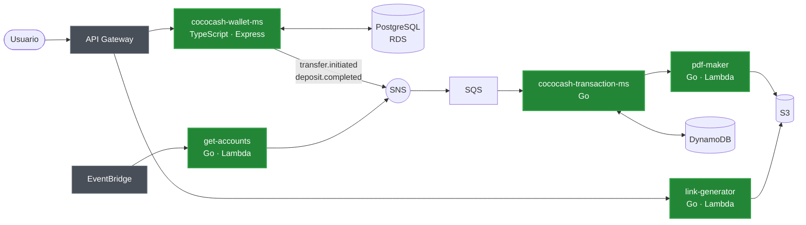
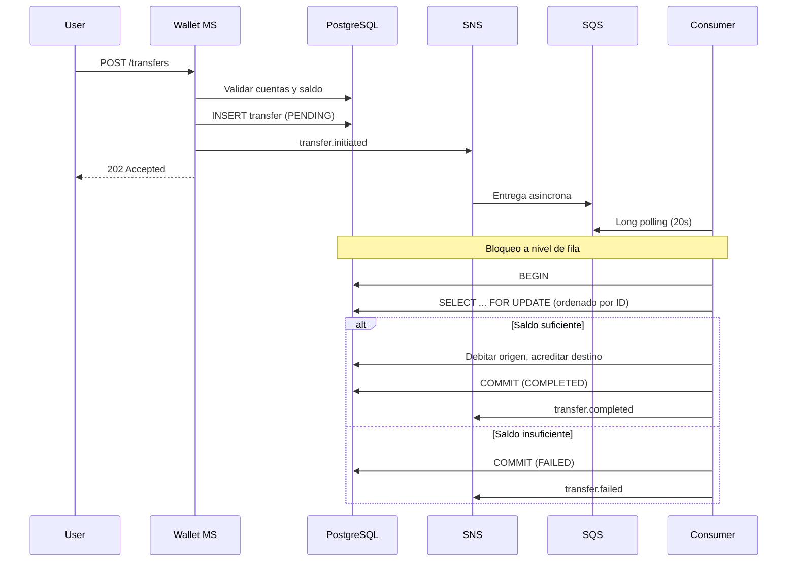
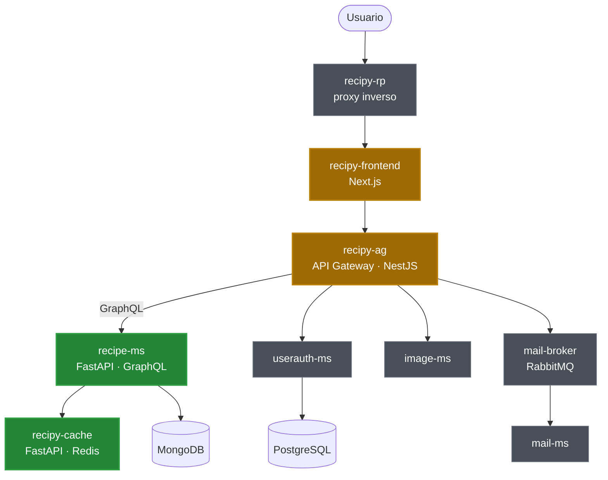

# Hola, soy Fabio 👋

Estudiante de último año de **Ingeniería de Sistemas y Computación** en la Universidad
Nacional de Colombia, e ingeniero de datos y nube.

Construyo backend distribuido, pipelines de datos y plataformas web. Me gusta la parte
que no se ve: la cola que no pierde mensajes, la transacción que no se corrompe cuando
dos usuarios tocan la misma cuenta al mismo tiempo, el `terraform apply` que levanta
todo desde cero.

> ** Mi código vive en las organizaciones de los
> equipos con los que trabajo:
>
> 🍳 **[recipy-swarch](https://github.com/recipy-swarch)** · 🥥 **[TeamC-swarchqua](https://github.com/TeamC-swarchqua)**

Los dos proyectos grandes son de curso, hechos en equipos de siete personas. En los
diagramas marqué **en verde lo que escribí yo**.

---

## 🥥 [CocoCash](https://github.com/TeamC-swarchqua/cococash) — billetera digital en AWS

Transferencias entre cuentas y generación de extractos bancarios, con arquitectura
orientada a eventos. El repositorio tiene el código de los servicios **y** la
infraestructura completa en Terraform.

**Lo que he trabajado:**

| Componente | Qué hace | Mío |
|---|---|---|
| `cococash-wallet-ms` | Cuentas, transferencias y depósitos sobre PostgreSQL  |
| `cococash-transaction-ms` | Consume eventos y construye el libro mayor en DynamoDB |
| `cococash-pdf-maker` | Genera el extracto en PDF y lo sube a S3  |
| `cococash-get-accounts` | Dispara la generación mensual desde EventBridge  |
| `cococash-link-generator` | Devuelve una URL prefirmada de S3 para descargar el extracto  |
| Terraform de red, ECS y API Gateway | VPC, ALB, Fargate, IAM  |

También el middleware de autenticación con **Cognito** (JWT + JITP) y el endpoint de
depósito con bloqueo a nivel de fila.

<b>El detalle que más me costó: transferencias concurrentes sin corromper saldos</b>

 

Una transferencia no puede ser una sola petición HTTP: si dos usuarios mueven plata de
la misma cuenta al mismo tiempo, el saldo se rompe. La resolví partiendo el flujo en dos
— una respuesta inmediata `202 Accepted` y un procesamiento asíncrono con
`SELECT ... FOR UPDATE` ordenado por ID para evitar interbloqueos.

Este diagrama está tomado de la documentación que escribí en el repo,
[`cococash-wallet-ms/docs/transfer-flow.md`](https://github.com/TeamC-swarchqua/cococash/blob/main/cococash-wallet-ms/docs/transfer-flow.md):

Si el consumidor falla, el mensaje vuelve a SQS por *visibility timeout*; a los tres
intentos cae en una DLQ en vez de perderse.

`TypeScript` `Go` `Terraform` `PostgreSQL` `DynamoDB` `AWS: ECS Fargate · Lambda · RDS · SNS · SQS · Cognito · S3 · EventBridge · ALB · VPC` `Docker`

---

## 🍳 [Recipy](https://github.com/recipy-swarch/recipy) — red social de recetas en microservicios

Dieciocho servicios, cuatro bases de datos, proxy inverso, y despliegue en Docker Compose
y Kubernetes.

🟩 escrito por mí · 🟨 aportes puntuales · ⬜ del resto del equipo

Fui responsable del **microservicio de recetas** (`recipe-ms`): API en FastAPI con GraphQL sobre MongoDB, validación de JWT, y los endpoints
de recetas, comentarios y likes. Escribí también el **servicio de caché** sobre Redis
(`recipy-cache`, 82 de 82 líneas) y lo integré con `recipe-ms`.

Aportes puntuales en la capa de servicios del frontend en Next.js, el enrutamiento del
gateway en NestJS, el `docker-compose` y los scripts de inicialización de MongoDB.

`Python` `FastAPI` `GraphQL` `MongoDB` `Redis` `TypeScript` `Next.js` `NestJS` `Docker` `Kubernetes`

---

## 🔧 Proyectos más chicos

**[devops-reto-automatizacion-entorno](https://github.com/GorenNM/devops-reto-automatizacion-entorno)** — repo propio. Una app Node.js contenerizada, un módulo de Terraform que construye y publica la imagen, y un script de gestión del entorno Docker. Infraestructura como código escrita de punta a punta por mí. · `Terraform` `Docker` `Node.js` `Bash`

**[gopdfsuit-qua](https://github.com/TeamC-swarchqua/gopdfsuit-qua)** — ⚠️ **es un fork** de [GoPdfSuit](https://github.com/chinmay-sawant/gopdfsuit) (MIT); Mi aporte encima: la suite de pruebas de integración y end-to-end (Playwright en el frontend, pruebas en Go en el backend), el reemplazo de Google OAuth por un servicio de autenticación propio en el middleware, y el análisis de seguridad y mantenibilidad — ZAP, Trivy, gosec, golangci-lint y modelo de amenazas. · `Go` `Playwright` `Vitest` `SAST/DAST`

---

## 🧰 Con lo que trabajo

|  |  |
|---|---|
| **Lenguajes** | Python · Go · TypeScript / JavaScript · SQL · Bash |
| **Nube** | AWS — ECS Fargate · Lambda · RDS · DynamoDB · S3 · SNS · SQS · EventBridge · Cognito · API Gateway · ALB · VPC · CloudWatch · ECR |
| **Datos** | PostgreSQL · MongoDB · DynamoDB · Redis |
| **Infraestructura** | Terraform · Docker · Docker Compose · Kubernetes · Nginx |
| **Backend** | FastAPI · GraphQL · Express · NestJS · arquitecturas orientadas a eventos |
| **Frontend** | Next.js · React |

---

## 📬 Hablemos

**femurcia6@gmail.com** · **[linkedin.com/in/fabio-murcia](https://linkedin.com/in/fabio-murcia)**
